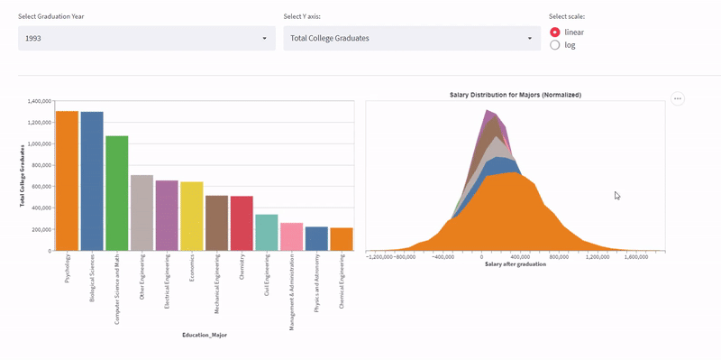

# Analysis of National Survey of Recent College Graduates

## Project Goals

The CORGIS Graduates CSV dataset is an aggregate of surveys conducted on Recent College Graduates from 1993 to 2015. The dataset contains the Year of Graduation, College Major, Student Ethnicity and Gender, After-Graduation Salary statistics, Employment and Employer data, to name a few. As graduate school students ourselves, we were very intrigued about the trends in education and employment throughout the years. We split the dataset into two components before starting our sketching and visualization analysis- Education & Student Demographics and After-Graduation Employment.   

For the Education& Student Demographics section, we aimed to analyze the College Majors by year and observe any patterns in our student demographics feature set. Specifically, we wanted to investigate College Majors preferred by underrepresented communities along the lines of race (Whites, minorities, and Asians) and gender. We were also curious to observe the after-graduation salary distribution for each College Majors for a given year. The data set also provided details regarding the degrees earned for the college major that year. We can identify majors with most Bachelors / Masters / Doctorate/ Professional degree holders by analyzing this data.

Second, we wanted to observe how students fared after graduating from each major for our Employment Analysis. For a given college major, how many students were unemployed/employed? Which work field was preferred by college graduates and is there any observable trend in their preferences, like- Are students desiring computer science more now than in the 90s? Are there equal work opportunities in the Public and Private sectors? To answer these questions, we wanted to experiment with various time series methods of plotting data using multi-line graphs and comparative bar charts and enhance our visualizations using interactivity to simplify data analysis.

## Design Decisions

#### Data

Let us explain the nature of the data we worked with. The Categorical identifiers in our dataset were the Year of Graduation and College Major. The rest was quantitative data composed of aggregate counts by education major, degree level, race, and gender. It also had summary statistics of salary information for graduates by year. Thus we were restricted to making the best use of time series charts for conveying changes by year and college major. 

#### Visual Encoding and Interactions

We chose bar charts for our  Education & Student Demographics Analysis to plot the categorical variable college major against dynamic quantitative data. We gave the user the choice of the variable on Y-axis and also limited the bar chart to show data for a single year. This approach saves on space to draw multiple charts conveying similar data. Apart from the choice of Y-axis variable, we also limit the plot to a single year for brevity purposes and give users an option to select log or linear scale to display the plot.

The histogram is linked with salary statistics in an adjacent area. The salary statistics are derived from the Salary Mean and Standard deviation and plotted by sampling points and binning them to get an approximately normal distribution. This chart helps us visualize the mean salaries and observe the deviations from the average salary offered to college graduates.

Our next graph uses a population pyramid chart to observe variations in college major preferences by gender for a selected year. This helps us find gender-based patterns and shifts in college major preferences throughout the years.

Since the dataset is primarily time series based, our visualizations would be incomplete without a line graph showcasing trends in college major preferences throughout the years. The multi-line graph is interactive with hover and select to focus functionality. The user can selectively analyze a subset of college majors and choose the year range to localize their analysis. This multi-line graph is linked to bar graphs that display bar charts for analyzing employment data. We primarily look at Employer Type, Employment Work field, and Employment status. The multi-line and succeeding bar charts are linked with the click to focus approach to display year-wise trends for the college major selected. The bar charts also have the feature to share a common axis scale across similar charts to make them easily comparable. In all our charts, we used tooltips to aid readability.

## Development Process

After finalizing the choice of the dataset, our first step was to sketch out all possible ideas for our visualizations. We observed the dataset columns and datatypes present and spent nearly one-week brainstorming ideas for creating interactive graphs. After finalizing sketches that we found intuitive, we split work among us based on developing charts for Education & Student Demographics and After-Graduation Employment Analysis.

Kriti worked on part 1 of the visualizations. She developed demographic charts to draw insights based on gender, race, and degree type. Choosing the proper data manipulation techniques, colors, and interactivity took her around 20 hours over three weeks. The aspects that took the most time were data wrangling and pruning components from the interactivity portion that did not turn out to be as insightful as expected. The lack of categorical data meant we had only year and education major fields to group the data; this made things challenging for us as Altair does not support multi-column plotting without any categorical variable to enclose our quantitative data. Stack bar graphs looked cluttered, so we had to resort to data slicing to plot perceptive graphs.

Sushanth worked on part 2 of the visualizations- the After Graduation Employment Analysis charts and the Salary Statistics plot. I experimented with multiple ways to display time-series interactions with the other variables like stacked area charts, multi-line charts, and stacked bar charts. But multi-line appeared to be the most perceptive among all. I also linked the employment analysis bar charts with selecting a trend line for a college major. Designing the salary statistics distribution plot took considerable time as Altair does not have the functionality to plot distributions using given mean and standard deviations in our dataset. We can effectively visualize the spread of salaries after graduation by plotting a normal distribution with a given mean and standard deviation. My part took me nearly 25 hours of work over three weeks.

## Key Insights and Success Story

One surprising discovery was that psychology has primarily been the most popular major over the 22 years the survey data was collected. Surprising since we initially hypothesized that engineering majors would be the most sought after, especially Computer Science.

While we knew that specific communities were bound to be underrepresented in education, especially in engineering fields, psychology has had more women than men, even back in 1993. But engineering majors are mostly male-dominated, even as recently as 2015.

We also observed that education majors have become more specialized through the years, with 1993 having only 12 education majors and 2015 having 45. 

Our multi-line chart clearly shows that the Dot-com bubble and 2008 financial crisis significantly hit students joining university /college. But In both cases, there was a sharp uptick in graduating students in succeeding years, implying economic recovery improved college admission rates as people wanted to upskill to aim for better careers. 

The two recessions did not impact students from Political Science and Sociology majors in 2000 and 2008. This is surprising but understandable as government and public sector jobs are the best protected in economic crises.
